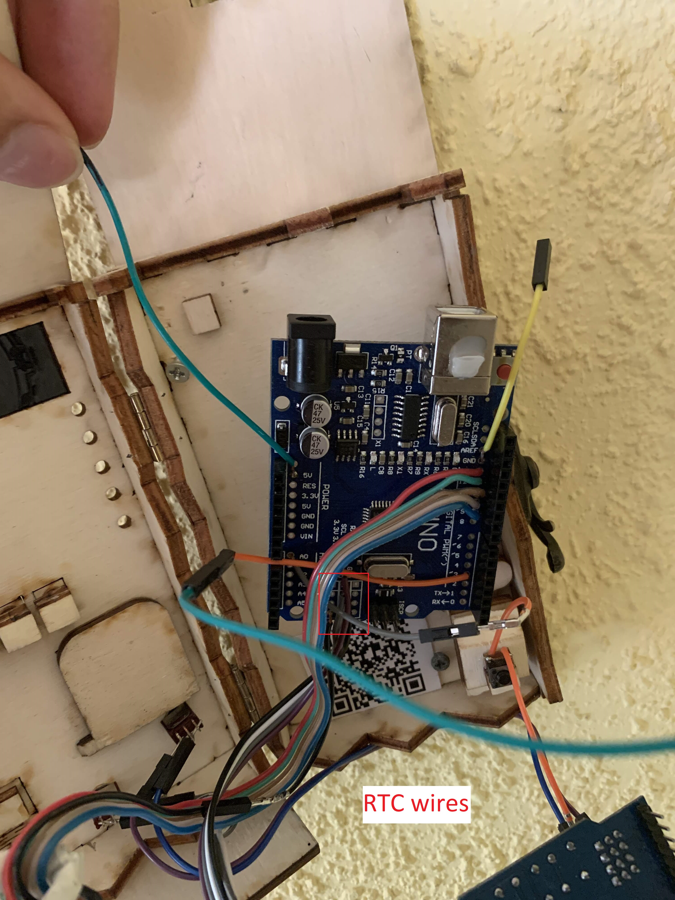
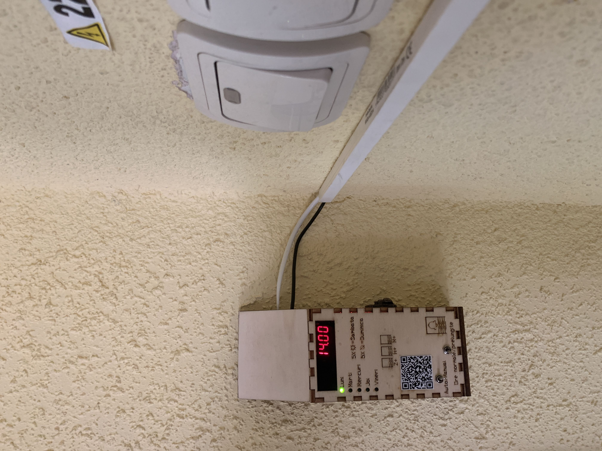
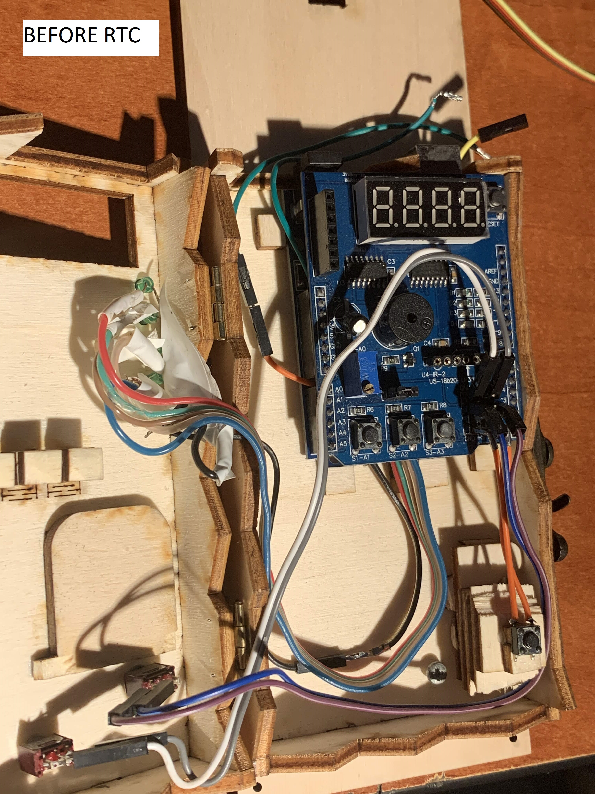

# automatic-school-ringer
how i made this / story: random government decision => chaos in (some) schools due to the removal of the service shift for highschool students that used to trigger the "saving" bell every day. at that moment, not every school had an automatic ringer (incl mine) which costed at the time of writing around 300 euros.

because i like programming & messing up with random hardware & creating stuff from scratch i volunteered to build a "thing" in 1 day which would actionate the bell in the school without any human interaction. *so the ETERNAL FRENCH CLASSES could not eat any more of the short break time*

the bell in my school is triggered by a "light switch" (https://images.app.goo.gl/EwDriSqizbXDUWe29 that would auto-release itself after you take your had off it (i dont know how its called... light switch with a spring inside at one end? ).
into the light switch were inserted 2 wires -  a hot wire and a ground one; 

connect these 2 wires => bell rings;

disconnect there 2 wires => nothing

=> we have a "how to turn on a lightbulb with arduino + relay tutorial on youtube” situation. hope you got the idea.

i added 2 more wires connecting the relay to the already existent switch. in case something goes wrong with my device, at least i can trigger with shame the bell using the "light switch".

software: (see ”later update 1” at the end of this note)
because i wanted/had to build this in one day, i did not bother with a RTC as i could not find any functional one in the entire city that day; it measures the time using millis() function and storing the time, minutes, hours and the current day in 4 variables. set up the clock once and hope for the best that it runs as long as possible. losing power would result in resetting the date/time to 00:00, monday. the device has buttons so anyone can set up the clock manually in case of a power outage (or if anyone pulls the charger out of the socket........). 

Note: during the 1 year functioning period, i had some issues at the beggining (explained at the end of the hardware section). just a passionate physics (+robotics) teacher bothered setting the time in case of a power outage / time freezing case... so a RTC would be a very welcomed module.

hardware:

-arduino uno

-custom* mullie function shield (with a 4 digit display for the time and buttons to set the time & day; * i removed the potentiometer from the shield and used that analog port for something else)

-few buttons and switches (for manual / auto mode - useful for exam days, holydays; normal/long classes, and a button to trigger the bell manually, like you would do with the "light switch")

-leds idicating the day (manually soldered to the chinese arduino clone, pins 9 -> 13. these pins are used to control the leds on the shield too)

-bad looking, kinda bulky housing.

--5V charger was too weak. the clock would freeze from time to time, causing me to go and commit a "ring" of shame during the classes/breaks. with a 9V charger it works just fine, no random freezes/bugs so far during a ~6 months period.--

Later update 1:
As the useless baccalaureate exam(s) finished (and because by the beggining of the next school year I will no longer be near my device), I have decided to add a RTC to the device. I have removed the potentiometer from the mullie shield and connected the rtc via the dedicated sql and sda pins on the chinese arduino clone (https://images.app.goo.gl/Z8XFEowb6UQwUkF5A).

Later update 2: 0 issues so far. the device has been working for 5 months at the time of writing this update

Photos:

